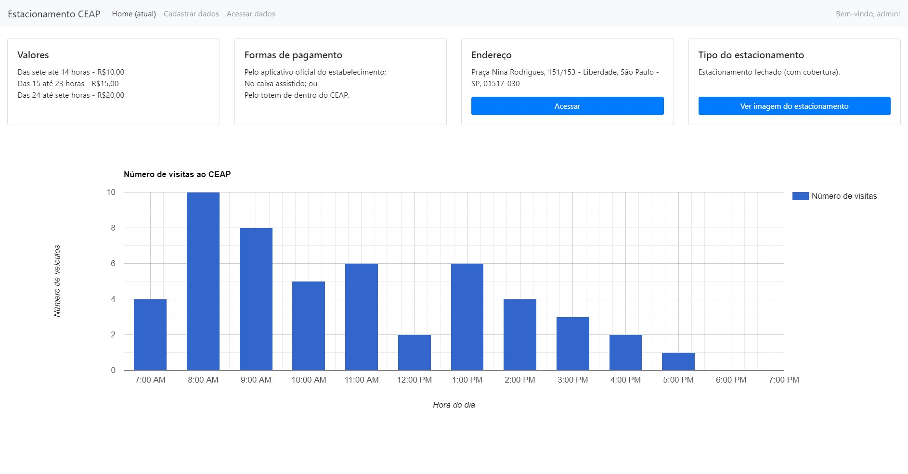

# estacionamento-ceap
Minha versão do projeto proposto pelo professor Nunes, auxiliado, no desenvolvimento do banco de dados, por Igor e Calles. O trabalho era: criar uma página em HTML (e PHP) capaz de registrar dados básicos de um estacionamento para um banco de dados em SQL.

## Projeto finalizado

Página principal, como administrador.

## ToDo
- [ ] Consertar os erros ao "deslogar" da conta de administrador;
- [x] Inserir dados (preços, horários, se o estacionamento é aberto ou fechado, endereço etc.) na home page; e
- [x] Adicionar gráficos de visitas na home page.

## Créditos (credits)
Diversos recursos foram usados, estes serão homenageados aqui:
- w3schools.com
- hostinger.com
- php.net
- stackoverflow.com
- getbootstrap.com
- pedreira.com
- codewithawa.com
- intechgrity.com
- codeproject.com
- tutorialspoint.com
- youtube.com
- professor
- images.pexels.com
- codigofonte.com.br
